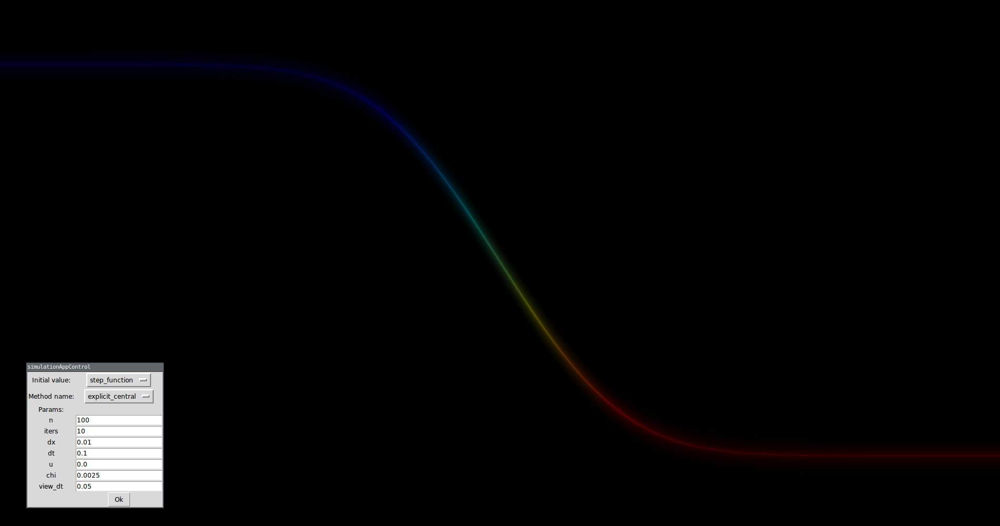

# ThermalConductivitySimulation

This is a [IFMO](http://www.ifmo.ru/) project about thermal conductivity simulation.
Simulation implemented on GPU via **OpenCL**, visualization uses **OpenGL**.

For more information you can read [wiki](https://github.com/PolarNick239/ThermalConductivitySimulation/wiki) (russian).

Sample screenshot:

